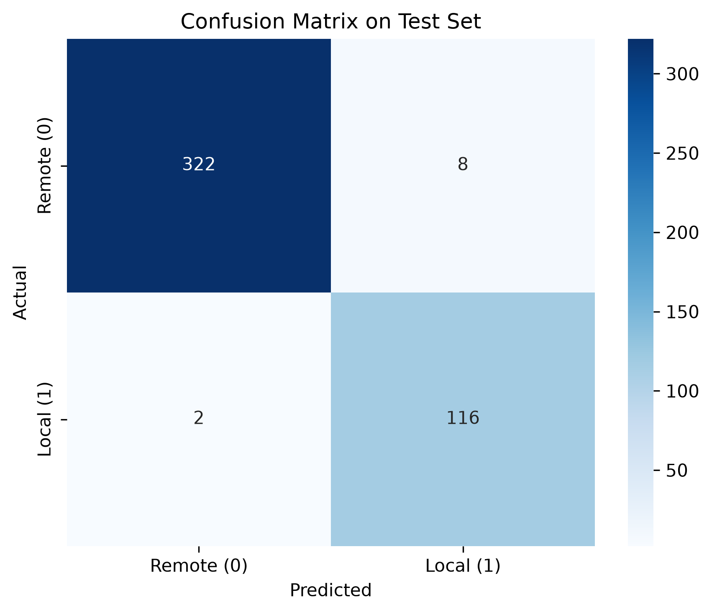
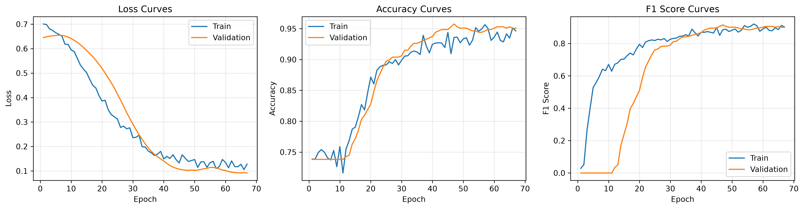
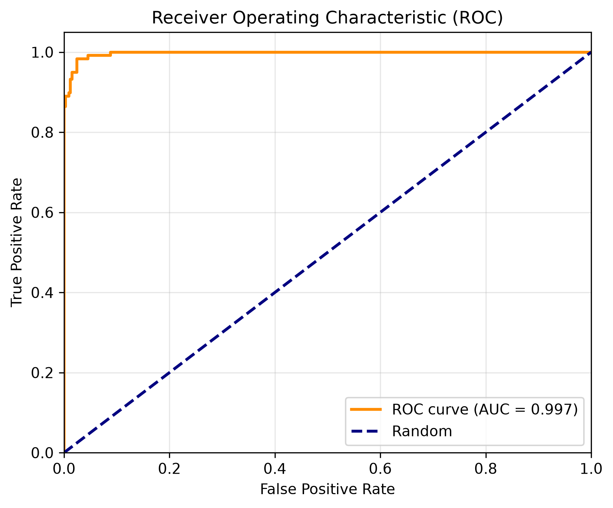

# 🚀 GNN-Based Data Locality Optimization in Big Data Systems

[](https://www.python.org/)
[](https://pytorch.org/)
[](https://www.pyg.org/)
[](https://spark.apache.org/)
[](https://hadoop.apache.org/)
[](https://www.docker.com/)
[](https://streamlit.io/)
[](LICENSE)

## 📌 Project Overview

This project aims to **optimize data locality** in distributed Big Data systems using **Graph Neural Networks (GNNs)**. In Hadoop/Spark clusters, poor data placement causes excessive network transfers and high latency. We model the cluster as a **heterogeneous graph** and train a GNN to predict whether a block placement is optimal (local) or not (remote).

The solution also includes a **Streamlit web application** to interact with the trained model and demonstrate the integration between **AI, Big Data, and interactive visualization**.

## 🎯 Problem Statement

In a distributed file system such as HDFS, data blocks are spread across multiple DataNodes. When a Spark job reads a block, if that block is not local to the node executing the task, it must be transferred over the network, leading to:

- ❌ Increased latency  
- ❌ Network congestion  
- ❌ Higher operational cost  
- ❌ Reduced throughput

## 💡 Proposed Solution

1. **Collect** cluster metrics (DataNodes, blocks, jobs, access patterns).  
2. **Store** raw data in HDFS.  
3. **Process** data at scale with Apache Spark.  
4. **Model** the cluster as a heterogeneous graph.  
5. **Train** a GraphSAGE-based GNN to classify placements as good or bad.  
6. **Deploy** an interactive Streamlit demo for real-time predictions.

## 🏗️ System Architecture

```
Data Collection → HDFS Storage → Spark Processing → Graph Construction → GNN Model → Placement Optimization → Evaluation
                                                         ↓
                                                   Streamlit Dashboard (interactive demo)
```

### Key Components

| Component | Technology | Purpose |
|-----------|------------|---------|
| Distributed Storage | Hadoop/HDFS | Store data blocks across nodes |
| Data Processing | Apache Spark/PySpark | Large-scale aggregation and feature engineering |
| Graph Representation | PyTorch Geometric | Heterogeneous graph with 3 node types |
| Machine Learning | GraphSAGE (GNN) | Learn node embeddings and classify edges |
| Interactive UI | Streamlit | Visualize results and run predictions |
| Containerization | Docker Compose | Reproducible Hadoop/Spark cluster |

## 📊 Results

### Model Performance on Test Set

| Metric | Value |
|--------|-------|
| **Accuracy** | **97.77%** |
| **Precision** | **93.55%** |
| **Recall** | **98.31%** |
| **F1-Score** | **95.87%** |

### Visualizations

- **Confusion Matrix**  
  

- **Learning Curves**  
  

- **ROC Curve**  
  

## 🛠️ Technologies Used

### Big Data Stack
- **Hadoop/HDFS** – distributed storage
- **Apache Spark/PySpark** – large-scale processing
- **CSV/Parquet** – data formats

### Machine Learning Stack
- **PyTorch** – deep learning framework
- **PyTorch Geometric** – graph neural networks
- **Scikit-learn** – metrics and preprocessing

### Web & Development Tools
- **Streamlit** – interactive dashboard
- **Docker & Docker Compose** – containerized cluster
- **VS Code** – IDE
- **Git/GitHub** – version control

## 📁 Project Structure

```
gnn-data-locality-optimizer/
│
├── data/
│   ├── raw/                 # Raw CSV files
│   ├── processed/           # Processed data (generated)
│   └── graphs/              # Serialized heterogeneous graph
│
├── src/
│   ├── data_collector.py    # Synthetic data generation
│   ├── spark_processor.py   # PySpark processing (local/HDFS)
│   ├── graph_builder.py     # Heterogeneous graph construction
│   ├── gnn_model.py         # GNN architecture (GraphSAGE)
│   ├── trainer.py           # Training loop with early stopping
│   └── evaluator.py         # Evaluation and visualization
│
├── streamlit_app/
│   └── app.py               # Streamlit interactive demo
│
├── docker/
│   ├── Dockerfile           # Project image
│   └── docker-compose.yml   # Hadoop + Spark cluster
│
├── notebooks/
│   └── 01_data_visualization.ipynb
│
├── scripts/
│   └── run_pipeline.ps1     # End-to-end pipeline (Windows)
│
├── results/
│   └── figures/             # Confusion matrix, learning curves, ROC
│
├── configs/
│   └── default.yaml         # Project configuration
│
├── tests/                   # Unit tests
├── docs/                    # Documentation
├── requirements.txt
└── README.md
```

## 🚀 Getting Started

### Prerequisites

- Python 3.8+
- Java 11 (for local Spark)
- Docker Desktop (for Hadoop/Spark cluster)
- Git

### Installation

```bash
# 1. Clone the repository
git clone https://github.com/oussamalakhili5/gnn-data-locality-optimizer.git
cd gnn-data-locality-optimizer

# 2. Create and activate a virtual environment
python -m venv venv
source venv/Scripts/activate  # Windows: venv\Scripts\activate

# 3. Install dependencies
pip install -r requirements.txt

# 4. Install PySpark (if not already included)
pip install pyspark==3.3.0

# 5. Install Streamlit
pip install streamlit
```

## 🖥️ Running the Streamlit Demo

The Streamlit app loads the trained GNN model and provides an interactive interface to explore results and make predictions.

```bash
streamlit run streamlit_app/app.py
```

Then open the displayed URL (usually `http://localhost:8501`).

**Features:**
- **Home** – project overview and sample visualizations.
- **Results** – performance metrics and charts.
- **Prediction** – select a Block and DataNode to see if the placement is predicted as local or remote.

## ⚙️ Running the End-to-End Pipeline

### Option A: Local mode (no Docker)

```powershell
# Windows PowerShell
.\scripts\run_pipeline.ps1 -Mode local
```

### Option B: HDFS mode with Docker

1. Start the Hadoop/Spark cluster:

```powershell
docker compose -f docker/docker-compose.yml up -d
```

2. Copy data to HDFS (see next section).
3. Run the pipeline:

```powershell
.\scripts\run_pipeline.ps1 -Mode hdfs
```

## 🐳 Docker & Spark Integration

### Starting the Cluster

```powershell
docker compose -f docker/docker-compose.yml up -d
```

### Copying Data to HDFS

```powershell
# Create HDFS directory
docker exec -it namenode hdfs dfs -mkdir -p /data/raw

# Copy files from local to container
docker cp data/raw/datanodes.csv namenode:/tmp/datanodes.csv
docker cp data/raw/blocks.csv namenode:/tmp/blocks.csv
docker cp data/raw/jobs.csv namenode:/tmp/jobs.csv
docker cp data/raw/access_patterns.csv namenode:/tmp/access_patterns.csv
docker cp data/raw/placements.csv namenode:/tmp/placements.csv

# Put files into HDFS
docker exec -it namenode hdfs dfs -put /tmp/datanodes.csv /data/raw/
docker exec -it namenode hdfs dfs -put /tmp/blocks.csv /data/raw/
docker exec -it namenode hdfs dfs -put /tmp/jobs.csv /data/raw/
docker exec -it namenode hdfs dfs -put /tmp/access_patterns.csv /data/raw/
docker exec -it namenode hdfs dfs -put /tmp/placements.csv /data/raw/
```

### Running Spark Processor on HDFS

```powershell
python src/spark_processor.py --hdfs
```

## 🧪 Running Tests

```bash
pytest tests/
```

## 📈 Key Learnings

This project demonstrates:

- **Big Data Engineering** : HDFS, Spark, Docker  
- **Graph Neural Networks** : heterogeneous graphs, GraphSAGE  
- **MLOps practices** : reproducible training, checkpointing, evaluation  
- **Interactive ML demos** : Streamlit for model interpretation  
- **End-to-end pipeline** : from data generation to deployment

## 📚 Documentation

- [Architecture](docs/architecture.md)
- [Methodology](docs/methodology.md)

## 🤝 Contributing

Contributions are welcome! Please open an issue or submit a pull request.

## 📝 License

This project is licensed under the MIT License - see the [LICENSE](LICENSE) file for details.

## 👤 Author

**Oussama Lakhili**  
- GitHub: [@oussamalakhili5](https://github.com/oussamalakhili5)  
- LinkedIn: [Your LinkedIn Profile](https://www.linkedin.com/in/oussama-lakhili-06aaa0234/)